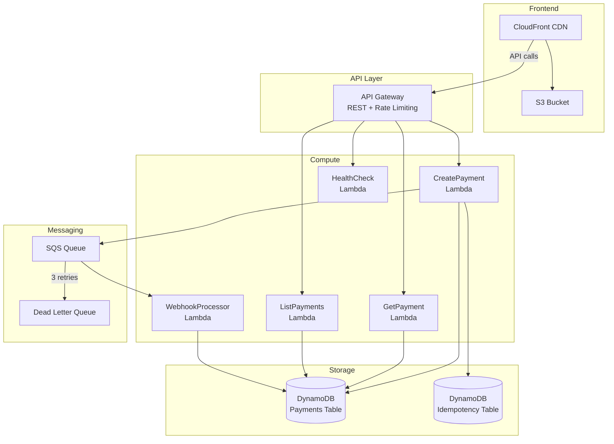
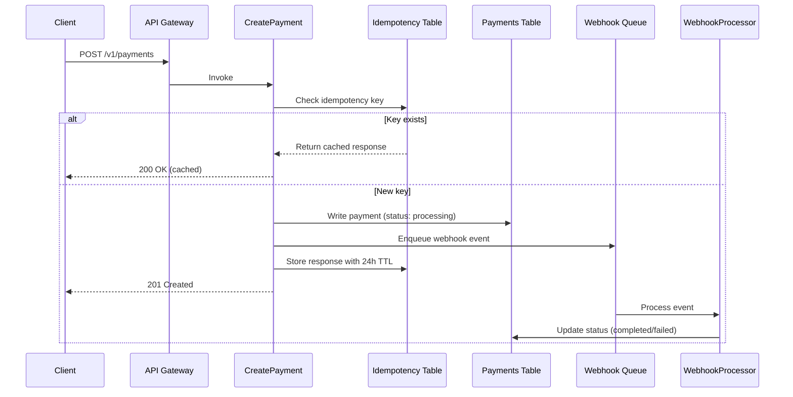
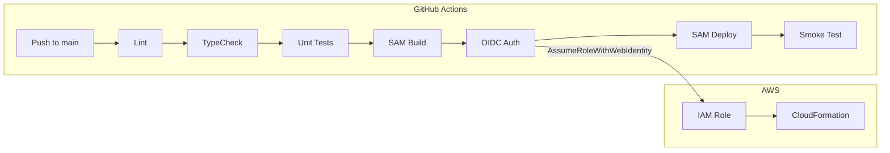

# PayFlow

A production-grade serverless payment gateway API built on AWS, demonstrating banking-grade patterns including idempotency, async webhook processing, and infrastructure as code.

**Live Frontend:** [https://d1fxk9nv78za9e.cloudfront.net](https://d1fxk9nv78za9e.cloudfront.net)

## Architecture



## Payment Flow



## CI/CD Pipeline



## Tech Stack

| Layer | Technology |
|-------|-----------|
| **Runtime** | Node.js 20.x on AWS Lambda (arm64/Graviton2) |
| **Language** | TypeScript (strict mode) |
| **API** | API Gateway REST (regional, rate-limited) |
| **Database** | DynamoDB (on-demand, single-table design with GSI) |
| **Queue** | SQS (standard, with DLQ and partial batch failures) |
| **Validation** | Zod schemas |
| **Middleware** | Middy v5 |
| **IaC** | AWS SAM (CloudFormation) |
| **CI/CD** | GitHub Actions with OIDC (zero stored credentials) |
| **Frontend** | React 19 + Vite 7 + TanStack Query 5 + Tailwind CSS v4 |
| **CDN** | CloudFront with Origin Access Control |
| **Bundler** | esbuild (via SAM metadata) |

## Features

- **Idempotent Payments** — Duplicate `POST /v1/payments` with the same idempotency key returns the cached response (24h TTL)
- **Async Webhook Processing** — SQS queue with DLQ (3 retries) and partial batch failure reporting
- **Single-Table DynamoDB** — Composite keys (PK/SK) with GSI for status-based queries
- **OIDC Authentication** — GitHub Actions deploys via `AssumeRoleWithWebIdentity`, no stored AWS credentials
- **Rate Limiting** — API Gateway throttling at 100 req/s sustained, 200 burst
- **Structured Logging** — JSON logs with correlation IDs for CloudWatch
- **Dark Fintech Dashboard** — React frontend with real-time payment data, metrics, and API docs

## API Endpoints

| Method | Path | Description | Status |
|--------|------|-------------|--------|
| `POST` | `/v1/payments` | Create a payment | 201 |
| `GET` | `/v1/payments/:id` | Get payment by ID | 200 |
| `GET` | `/v1/payments` | List payments (filterable by status) | 200 |
| `GET` | `/v1/health` | Health check | 200 |

### Create Payment

```bash
curl -X POST https://qmago27u40.execute-api.ca-central-1.amazonaws.com/dev/v1/payments \
  -H "Content-Type: application/json" \
  -d '{
    "merchant": "Shopify Inc.",
    "amount": 250.00,
    "currency": "CAD",
    "type": "eft",
    "idempotency_key": "unique-key-001",
    "description": "Monthly subscription"
  }'
```

### List Payments

```bash
# All payments
curl https://qmago27u40.execute-api.ca-central-1.amazonaws.com/dev/v1/payments

# Filter by status
curl "https://qmago27u40.execute-api.ca-central-1.amazonaws.com/dev/v1/payments?status=completed&limit=10"
```

## Project Structure

```
payflow/
├── backend/
│   ├── src/
│   │   ├── handlers/          # Lambda function handlers
│   │   │   ├── createPayment.ts
│   │   │   ├── getPayment.ts
│   │   │   ├── listPayments.ts
│   │   │   ├── healthCheck.ts
│   │   │   └── webhookProcessor.ts
│   │   ├── services/          # AWS SDK clients
│   │   │   ├── dynamodb.ts
│   │   │   └── sqs.ts
│   │   ├── models/            # Zod schemas + TypeScript types
│   │   │   └── payment.ts
│   │   ├── middleware/        # Structured logger
│   │   │   └── logger.ts
│   │   └── utils/             # Response helpers, constants
│   ├── tests/                 # Jest unit tests (mocked AWS SDK)
│   ├── scripts/               # Seed data, IAM policies
│   ├── template.yaml          # SAM template (API GW, Lambda, DDB, SQS)
│   └── samconfig.toml         # Deployment configuration
├── frontend/
│   ├── src/
│   │   ├── components/        # Dashboard, PaymentTable, ApiDocs, etc.
│   │   ├── hooks/             # TanStack Query hooks
│   │   ├── services/          # API client
│   │   └── types/             # TypeScript interfaces
│   └── .env.production        # API URL baked at build time
├── infra/
│   └── frontend-stack.yaml    # S3 + CloudFront CloudFormation
└── .github/workflows/
    ├── deploy-backend.yml     # Backend CI/CD (SAM deploy + smoke test)
    ├── deploy-frontend.yml    # Frontend CI/CD (S3 sync + CF invalidation)
    └── pr-check.yml           # PR validation (lint, typecheck, test, build)
```

## Local Development

### Prerequisites

- Node.js 20.x
- AWS CLI v2
- AWS SAM CLI

### Backend

```bash
cd backend
npm install
npm run lint        # ESLint
npm run typecheck   # TypeScript compiler check
npm test            # Jest (36 tests, mocked AWS SDK)
```

### Frontend

```bash
cd frontend
npm install
npm run dev         # Vite dev server at localhost:5173
npm run build       # Production build
npm run lint
npm run typecheck
```

## Deployment

Deployments are fully automated via GitHub Actions on push to `main`:

- **Backend changes** (`backend/**`) trigger `deploy-backend.yml` — runs lint, typecheck, tests, SAM build + deploy, and a smoke test against the live API
- **Frontend changes** (`frontend/**`) trigger `deploy-frontend.yml` — runs lint, typecheck, build, S3 sync, and CloudFront cache invalidation

Both workflows authenticate to AWS via OIDC (no stored credentials).

## AWS Resources

| Resource | Name | Purpose |
|----------|------|---------|
| API Gateway | PayFlowApi | REST API with CORS and rate limiting |
| Lambda x5 | payflow-dev-* | Request handlers + webhook processor |
| DynamoDB | payflow-payments-dev | Payment records (PK/SK + GSI) |
| DynamoDB | payflow-idempotency-dev | Idempotency cache (24h TTL) |
| SQS | payflow-webhooks-dev | Async webhook processing |
| SQS | payflow-webhooks-dlq-dev | Dead letter queue (3 retries) |
| S3 | payflow-frontend-dev-* | Frontend static assets |
| CloudFront | E3GUFACW1OHHMM | CDN with OAC + SPA routing |

## License

MIT
