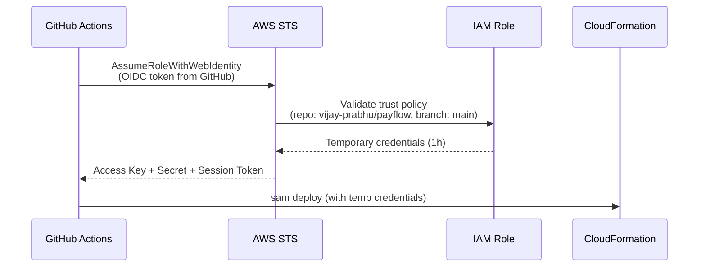

# PayFlow Architecture

## Overview

PayFlow is a serverless payment gateway API deployed on AWS in `ca-central-1`. It processes payment requests through API Gateway, executes business logic in Lambda functions, persists data in DynamoDB, and handles asynchronous webhook delivery via SQS.

## Design Decisions

### Single-Table DynamoDB Design

Payments use a composite key pattern:
- **PK:** `PAY#<payment-id>` (e.g., `PAY#PAY-6E8B4A0B`)
- **SK:** `PAYMENT` (fixed for the payment entity)

This allows future expansion to store related entities (e.g., refunds, events) under the same partition key with different sort keys.

A **Global Secondary Index** (`status-createdAt-index`) enables efficient queries by payment status with chronological ordering, supporting the `GET /v1/payments?status=completed` use case without full table scans.

### Idempotency Pattern

The `POST /v1/payments` endpoint supports idempotent requests via a separate DynamoDB table:

1. Client sends a request with an `idempotency_key` in the body
2. Lambda checks the idempotency table for an existing record
3. If found, returns the cached response (HTTP 200, not 201)
4. If not found, processes the payment and stores the response with a 24-hour TTL

The idempotency table uses DynamoDB TTL for automatic cleanup — no cron jobs or manual purging needed.

### Async Webhook Processing

After a payment is created, an event is enqueued to SQS. The `WebhookProcessor` Lambda:

1. Receives batches of up to 10 messages
2. Simulates webhook delivery (85% success rate for demo purposes)
3. Updates payment status to `completed` or `failed`
4. Uses `ReportBatchItemFailures` for partial batch failure handling — only failed messages are retried

Failed messages retry up to 3 times before moving to the Dead Letter Queue (DLQ) with 14-day retention.

### OIDC Authentication for CI/CD

GitHub Actions authenticates to AWS using OpenID Connect — no AWS access keys are stored in GitHub secrets:

The IAM role's trust policy restricts access to:
- Only the `vijay-prabhu/payflow` repository
- Only the `main` branch (for deploy workflows)

### Frontend Architecture

The React frontend is a static SPA deployed to S3 and served via CloudFront:

- **Origin Access Control (OAC):** S3 bucket is fully private; CloudFront authenticates via SigV4
- **SPA Routing:** Custom error responses return `index.html` for 403/404, so React Router handles all routes
- **API URL:** Baked into the build via `VITE_API_URL` environment variable (Vite replaces `import.meta.env` at build time)
- **CORS:** Backend API only accepts requests from the specific CloudFront domain

## Infrastructure as Code

All infrastructure is defined in CloudFormation/SAM templates:

| Template | Stack | Resources |
|----------|-------|-----------|
| `backend/template.yaml` | `payflow-dev` | API Gateway, 5 Lambda functions, 2 DynamoDB tables, SQS + DLQ |
| `infra/frontend-stack.yaml` | `payflow-frontend-dev` | S3 bucket, CloudFront distribution, OAC, bucket policy |

## Security

- **No long-lived credentials in CI/CD** — OIDC provides temporary 1-hour tokens
- **Principle of least privilege** — Each Lambda function has only the IAM permissions it needs (e.g., `DynamoDBReadPolicy` for read-only handlers)
- **Private S3 bucket** — Frontend assets are only accessible via CloudFront OAC
- **CORS restriction** — API only allows requests from the CloudFront domain
- **Rate limiting** — API Gateway throttles at 100 req/s sustained, 200 burst
- **Input validation** — All request bodies validated with Zod schemas before processing

## Cost Optimization

The entire stack runs within or near the AWS Free Tier:

- **Lambda:** 1M free requests/month, 400K GB-s compute
- **DynamoDB:** 25 RCU + 25 WCU free (on-demand mode charges per request)
- **API Gateway:** 1M API calls free for 12 months
- **SQS:** 1M requests free/month
- **S3:** 5 GB storage free for 12 months
- **CloudFront:** 1 TB data transfer free for 12 months
- **Graviton2 (arm64):** 20% cheaper than x86 Lambda pricing
